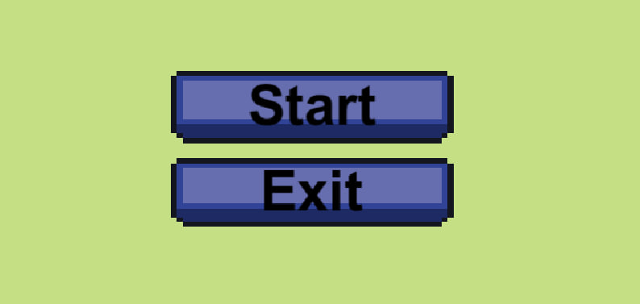
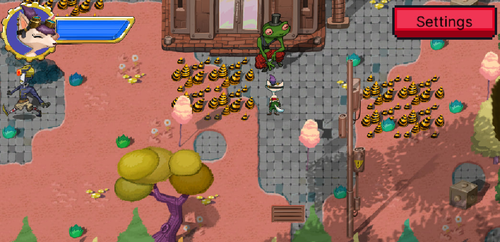
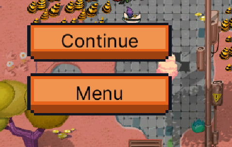
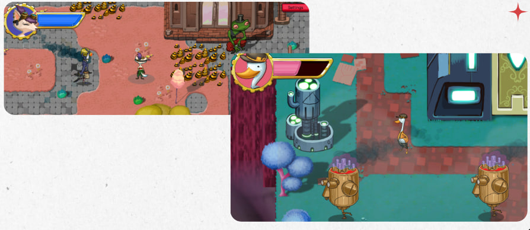

# Robot Fixer Game

**Robot Fixer** is a 2D top-down adventure game developed in **Unity** using **C#**.  
Players control a character to **repair malfunctioning robots** while avoiding hazards and managing health.

This project demonstrates:
- Player movement and animation using Rigidbody2D and Animator
- Health and damage systems
- Projectile mechanics
- Object interaction and repair logic
- Unity Input System (for keyboard/controller)
- Audio integration
- UI updates and win conditions

---

## 🎮 Gameplay

### Objective
- Move your character (Ruby or Ducko) around the scene
- Repair all broken robots using projectiles
- Avoid enemy collisions to prevent losing health
- Interact with NPCs for dialogue

### Player Characters
- **RubyController**
- **DuckoController**

Both share similar mechanics:
- **Movement**: 2D top-down using InputAction
- **Health system**: max health, invincibility frames, respawn
- **Projectile launching**: used to repair robots
- **Dialogue interaction**: with NPCs
- **Win condition**: repair all robots to trigger a win event or panel

---

## 🤖 Enemies
- Move along a set path (horizontal or vertical)
- Damage the player on collision
- Can be repaired by the player
- Visual feedback:
  - Smoke particle while malfunctioning
  - Fixed particle effect when repaired
- Audio feedback on hit and repair

---

## 🛠 Features

### Player Mechanics
- Smooth 2D movement with Rigidbody2D
- Health management with invincibility
- Projectile launching to fix robots
- Collision detection with enemies
- Interaction with NPCs using raycasts
- Win condition triggers UI panels

### Enemy Mechanics
- Path-based movement (horizontal or vertical)
- Sprite animation based on direction
- Collision damage
- Repairable by projectiles

### Projectiles
- Launched in player’s look direction
- Destroyed on collision
- Trigger enemy repair on hit

### Audio & Visuals
- Sound effects for:
  - Player hit
  - Projectile launch
  - Enemy hit and repair
- Particle effects:
  - Hit feedback
  - Smoke for enemies
  - Fixed robot effect
- Animator for both players and enemies

### UI & Feedback
- Health bar updates dynamically
- Win panel shows when all robots are repaired
- ButtonController integration for next level or world

---

## ⚙ Technologies
- Unity Engine
- C#
- Unity Input System
- Rigidbody2D & Collider2D
- Animator & Animation States
- ParticleSystem for effects
- AudioSource for sounds
- Debug logging for development

  

